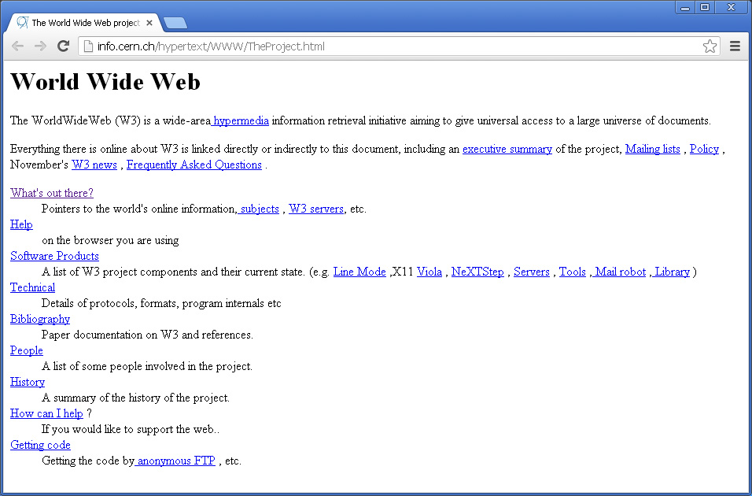
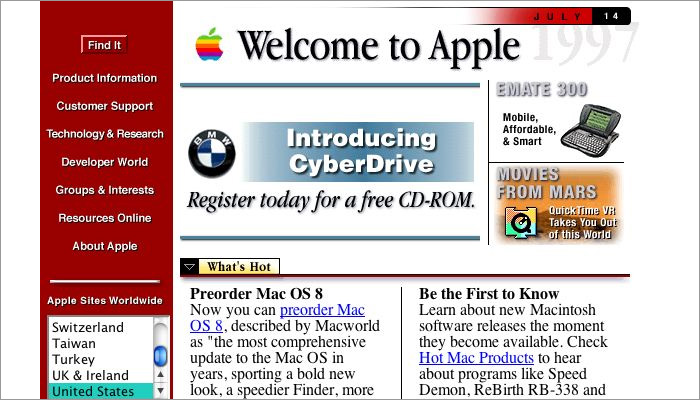
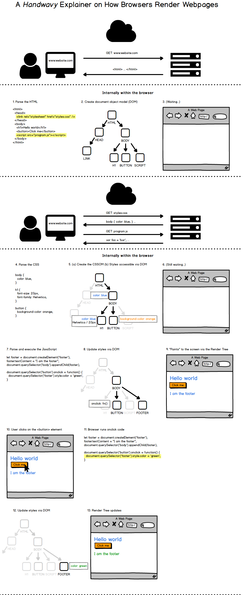
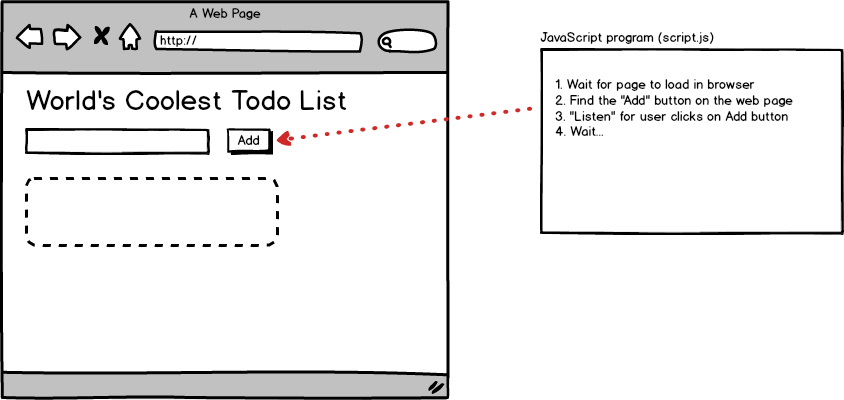
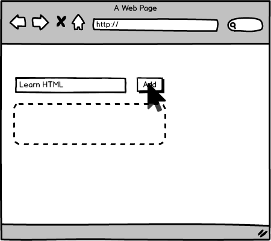
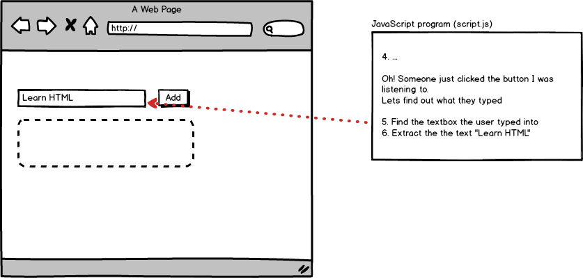
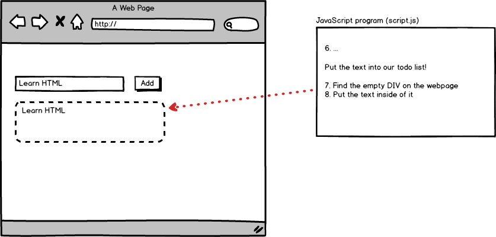
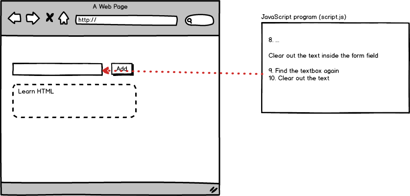
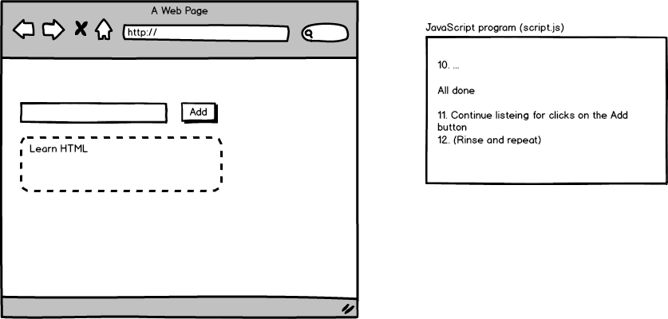

## While we wait to get started

- Install Google Chrome or Firefox
  - https://www.google.com/chrome/
  - or https://www.mozilla.org/en-US/firefox/new/
- Install "LTS" Node (not Current) https://nodejs.org/en/

---

# JavaScript Bootcamp 🥾🥾🥾

---

## About me 🤓

- @ericmasiello
- Principal Software Engineer @ Vistaprint
- Front-End Web Development (FEWD) Instructor at General Assembly
- Co-Author of _Mastering React Native_

--

## Your turn to share 🤗

- Your name
- Any programming experience? (HTML, JavaScript, CSS, C, etc.)
- What brought you here today

---

## Agenda

TODO

---

## Setting expectations

One day is not a lot of time.

---

## What is JavaScript?

- Insanely popular
- High level syntax, low(ish) barrier to entry
- One of two languages that run in the browser (the other is WebAssembly)
- Can be used "server-side" or "client-side"

Note:

- High level syntax means you don't need to program to the specific hardware, the language is more generalized and typically easier to write
- Hasn't always been only browser language, nor will it always be (probably)
- Runs on the server, in robots, databases, etc

--

### In the beginning, there was HTML



<small>Credit: A Look Back at 20+ Years of Website Design - Myia Kelly</small>

Note:

- Internet predates web pages (developed by military and universities for information sharing)
- WWW and HTML invented at CERN in the late 80s, early 90s in large part by Tim Berners-Lee
- No styles, no interactivity - just text and links

--

### Make it pretty(ish)



<small>Credit: A Look Back at 20+ Years of Website Design - Myia Kelly</small>

--

### Make it interactive!


Note:

- JavaScript was developed in 10 days by one developer (Brendan Eich) for Netscape. It needed to be done quickly so that it could gain adoption over Microsoft's browser language.
- Has evolved enormously since 1995 when it was created

--

## Java vs. JavaScript

Very, very, very different.

(But a little similar)

Note:

- Two completely different languages
- At around the time time JavaScript was created, Java was newish and had a lot of buzz
- The language was originally named as LiveScript
- Netscape renamed it to JavaScript to capitalize on the cachet of Java at the time
- If you ever do a job interview, don't confuse these two languages

--

## JavaScript vs. Javascript

- Officially, its "JavaScript"
- In reality, no one cares

<style type="text/css">
#javascript-vs-javascript {
    text-transform: none;
}
</style>

---

## 🚨🚨🚨 Skiping the Basics 🚨🚨🚨

(Don't worry, we'll back to it)

---

## What's the DOM?

--

## Browser rendering in action

[](img/browser-rendering-dom-diagram.png)

--

## More details on how browser rendering works

https://itnext.io/how-the-browser-renders-a-web-page-dom-cssom-and-rendering-df10531c9969

--

## DOM: Document Object Model

- Tree data structure managed by the web browser
- Exposes an "API" to JavaScript allowing web developers to:
- Manipulate what is rendered to the screen
- Respond to interactions (e.g. specify what happens when a user clicks)

Note:

- DOM is techncially not part of the JavaScript language. Its part of the browser

--

## DOM: Document Object Model

> Essentially, the DOM is an internal data structure managed by web browsers that represents what is in the web page. It takes **HTML**, **CSS**, and instructions written in **JavaScript** to decide what it should display at any moment.

---

## `document` object

- Browser exposes the DOM to JavaScript via the `document` object
- Most client-side JavaScript involves manipulating the DOM via the `document` object

```js
// Create a <p> node
var pNode = document.createElement("p");
// Create a text node
var textNode = document.createTextNode("Hello world");
// Append the text to <p>
pNode.appendChild(textNode);
// Append <p>Hello world</p> to <body>
document.querySelector("body").appendChild(pNode);
```

--

## Getting data from the DOM

| Method Name           | Description                                   |
| --------------------- | --------------------------------------------- |
| `.getElementById()`   | Gets a single element by an ID selector       |
| `.querySelector()`    | Gets a single element matching the selector   |
| `.querySelectorAll()` | Gets a list of elements matching the selector |

\* There are additional methods for getting DOM nodes

--

## `getElementById`

```html
<html>
  <body>
    <h1 id="title">The title</h1>
    <p class="message">foo</p>
    <p>bar</p>
    <p class="message">baz</p>
  </body>
</html>
```

```js
// returns a single Node
var titleElement = document.getElementById("title");
```

--

## `querySelector`

```html
<html>
  <body>
    <h1 id="title">The title</h1>
    <p class="message">foo</p>
    <p>bar</p>
    <p class="message">baz</p>
  </body>
</html>
```

```js
// returns a single Node
var titleElement = document.querySelector("#title");

// returns a single Node, but which one?
var messageElement = document.querySelector(".message");
```

--

## `querySelectorAll`

```html
<html>
  <body>
    <h1 id="title">The title</h1>
    <p class="message">foo</p>
    <p>bar</p>
    <p class="message">baz</p>
  </body>
</html>
```

```js
// returns a NodeList of 2 elements
var messageElements = document.querySelectorAll(".message");

// returns a NodeList of 3 elements
var allParagraphElements = document.querySelectorAll("p");
```

--

## JavaScript in the wild

- [Form Validation](https://formvalidation.io/guide/plugins/bootstrap/)
- [Dynamic Navigation](https://generalassemb.ly/education/digital-marketing)

---

### How do we add JavaScript to a webpage?

### `<script></script>`

--

```html
<!DOCTYPE html>
<html>
  <head>
    <link rel="stylesheet" type="text/css" href="css/styles.css" />
  </head>
  <body>
    <!-- your webpage contents -->
    ...

    <script src="script.js"></script>
  </body>
</html>
```

Put it right before the closing `</body>` element

--

```html
<!DOCTYPE html>
<html>
  <head>
    <link rel="stylesheet" type="text/css" href="css/styles.css" />
    <script defer src="script.js"></script>
  </head>
  <body>
    <!-- your webpage contents -->
    ...
  </body>
</html>
```

Or use the `defer` attribute and put the `script` element anywhere

---

## Syntax

"...set of rules that defines the combinations of symbols that are considered to be a correctly structured \[code\] in that language."

\- [Wikipedia](https://en.wikipedia.org/wiki/Syntax_(programming_languages)

Note:
Like with any language, there are formal rules around how to write it. This is the syntax.

--

### JavaScript syntax examples

- Semicolon: marks the end of a statment
- Quotation Marks: a string (of characters)
- Parentheses: used to define or execute a function

```javascript
function illuminateRed() {
  // do stuff
}

function setupEvents() {
  document.getElementById("stopButton").onclick = illuminateRed;
}

setupEvents();
```

--

### JavaScript syntax - comments

```javascript
// Single Line Comments
```

```javascript
/*
Multi
line
comments
*/
```

--

TODO: are there more syntax related slides i can use from the other guy's deck??

--

### Basic JavaScript Syntax

[https://www.w3schools.com/js/js_syntax.asp](https://www.w3schools.com/js/js_syntax.asp)

---

## Responding to &ldquo;events&rdquo;

`event + event handler => run some code`

Note:

- Let's cover some basic definitions

--

### Event

Typically a user interaction

e.g. click, scroll, mouseover (hover), etc.

```html
<!-- I want to know when someone clicks on this button -->
<button id="addTodo">Create new todo</button>
```

--

### Event listener/handler

A `function` whose job is to respond to some user input.

```js
// I want to know whenever someone *clicks* on the element
// with an id of "addTodo"
```

--

### Function

A self-contained set of instructions that can be reusable

```javascript
function handleAddTodo() {
  // code here that picks a card at random
}
```

Functions can be easily rerun (e.g. on every click, run these instructions)

--

### Example

HTML

```html
<!-- I want to know when someone clicks on this button -->
<button id="addTodo">Create new todo</button>
```

JS

```js
function handleAddTodo() {
  // code that adds the todo item to your todo list
}

// whenever someone clicks the html tag with an id="addTodo",
// run the handleAddTodo function
document.querySelector("#addTodo").onclick = handleAddTodo;
```

---

## How we solve problems in the browser with JavaScript

1.  Find some elements on the page
2.  Listen for some user interaction (click, scroll, mouseover)
3.  Respond to that event
    - Add, remove, or modify HTML
    - Add, remove, or modify CSS
    - Or anything else 🤓

--



--



--



--



--



--



---


## Traffic light

https://codesandbox.io/s/stop-light-6yw3q

- Click the "fork" button in the top right

--

## Traffic light Assignment

_15 mins_

1. Make the slow button turn the 2nd light yellow
2. Make the go button turn the last light green
3. **BONUS:** Make it so that I can click the lights themselves to turn them on

_Once you've completed step 2, use the thumbs up reaction on Zoom_

---

## Variables & data types

--

### Variable

Containers for storing data values.

```javascript
let age = 13;
```

--

### Variable declaration

- `let` or `var` keywords tells our program that we wish to make a variable
- We choose the name
- Variables must only be _declared_ once

```javascript
let age;
var name; // "legacy", we won't be using "var"
```

--

### Variable assignment

- Give our declared variable a value
- This can happen multiple times

```javascript
age = 13;
```

--

### Variable assignment and declaration

```javascript
// Do assignment and declaration separately
let a;
a = 22;

// Do assignment and declaration at the same time
let b = a + 2;
```

--

### Variable reassignment

```javascript
// give it an intial value
let a = "Eric";

// later, give it a new value
a = "Erika";
```

--

### Constants

Allow you to assign a value once

```javascript
const a = "Eric";

a = "Erika"; // ERROR!!!!! 🚨🚨🚨
```

--

### Use `let` or `const`?

- Prefer `const`
- Use `let` only when you need to reassign it

--

### Difference between `var` and `let`

- Both allow reassignment
- `let` is scoped to "blocks"
- `var`s are scoped to functions

```javascript
function someFunction(input) {
  var var1 = "var1"; // scoped to function
  let let1 = "let1"; // scoped to nearest block (which is a function)
  if (input > 4) {
    var var2 = "var2"; // scoped to function
    let let2 = "let2"; // scoped to if {} block
  }
  
  console.log(var1); // OKAY!
  console.log(let1); // OKAY!
  console.log(var2); // OKAY!
  console.log(let2); // ERROR! 🚨🚨🚨
}
```

--

### Name variables using "camelcase"

- Start with lowercase letter
- Each new word is capitalized

```javascript
let numberOfStudents = 20;
```

--

### Variable naming rules (syntax)

- Names can contain letters, digits, underscores, and dollar signs
- Names must begin with a letter, \$, or \_
- Names are case sensitive (y and Y are different variables)
- Reserved words (e.g. `function` or `while`) cannot be used as names

---

## Data types

--

### Breaking down this line of code

```js
let numberOfStudents = 20;
```

- JavaScript reservered word: `var`
- Name: `numberOfStudents`
- Value: `20`

--

### Data types

What can those _values_ be??

--

### JavaScript data types

- _Boolean_
- Null
- Undefined
- _Number_
- _String_
- Symbol
- Object\*

\* includes Dates, Arrays, Regular Expressions, Functions, and more

--

### Number

```javascript
// We call this type of number an "integer"
let myInteger = 10;

// And this type a "float"
let myFloat = 10.13093;

let sum = myInteger + myFloat;
```

--

### Common JavaScript Math Operators

| Operator |  Description   |      Example |
| -------- | :------------: | -----------: |
| `+`      |    Addition    | `x = y + 2;` |
| `-`      |  Subtraction   | `x = y - 2;` |
| `*`      | Multiplication | `x = y * 2;` |
| `/`      |    Division    | `x = y / 2;` |
| `%`      |   Remainder    | `x = y % 2;` |

[JavaScript Arithmetic Operators](https://developer.mozilla.org/en-US/docs/Web/JavaScript/Reference/Operators/Arithmetic_Operators)

--

### String

Text, a collection of characters

```javascript
let firstName = "Eric";

let lastName = "Masiello";

// fullName = 'Eric Masiello'
let fullName = firstName + " " + lastName;
```

Note:

This operation is called concatenation

--

### Ways to define strings

```javascript
const firstName = "Eric";  // double quotes
const lastName = 'Masiello'; // single quotes
const middleName = `Jon`; // backticks
```

--

### Backticks

Allows you to "interpolate" a string (aka fancy concatenation)

```javascript

const name = 'Eric';
const numberOfAssignments = 3;

// message = 'Hello, Eric. You have 3 assignments';
const message = `Hello, ${name}. You have ${numberOfAssignments} assignments`;
```

--

### Boolean

True or False

```javascript
let lightOn = true;

function turnLightsOff() {
  lightOn = false;
}
```

---


## Score keeper

[CodePen](https://codepen.io/ericmasiello/pen/VWXWEB?editors=1010)

- Fork this on Codepen

--

## Score keeper Assignment

_15 mins_

Keep a running total.

// TODO

_If you finish early, help others around you if they're stuck._

---

## Objects

Containers that hold multiple related properties.

```javascript
const instructor = {
  name: 'Eric',
  favoriteLanguage: 'JavaScript',
  yearsTeaching: 6,
};
```

--

### Reading properties of an object

Use the "dot" notation to access properties of an object

```javascript
const instructor = {
  name: 'Eric',
  favoriteLanguage: 'JavaScript',
  yearsTeaching: 6,
};

const greeting = 'Hello, ' + insturctor.name;
const likes = instructor.name + ' likes ' + instructor.favoriteLanguage;
```

--

Also use dot notation to update a property of an object

```javascript

const instructor = {
  name: 'Eric',
  favoriteLanguage: 'JavaScript',
  yearsTeaching: 6,
};

instructor.favoriteLanguage = 'CSS';

const likes = instructor.name + ' likes ' + instructor.favoriteLanguage;
```

---

## Functions

--

### Declaring a function

Delcare with the `function` keyword, `()`, and a pair of `{}`;

```javascript
function setClassName() {
  document.querySelector('#foo').className = 'bar';
}
```

--

### Calling a function

```javascript
function setClassName() {
  document.querySelector('#foo').className = 'bar';
}

setClassName(); // this tells the program to run the body of the function
```

--

### Arrow functions

Similar to `var` vs. `let`, there are some subtle differences with "regular" function declarations and arrow functions

```
const setClassName = () => {
  document.querySelector('#foo').className = 'bar';
};

setClassName();
```

--

### Parameters and Arguments

Functions allow you to _pass_ values to them to be used within their functino body.

```javascript
function setCustomClassName(className) { // className is the parameter
  document.querySelector('#foo').className = className;
}

setCustomClassName('error'); // 'error' is the argument
setCustomClassName('warning'); // 'warning' is the argument
setCustomClassName(''); // '' (empty string) is the argument
```

--

### Mental model of Arguments and Parameters

```javascript
function setCustomClassName(className) {
  // once this function is called with 'error', internally its as if 
  // the program has inserted the following line of code
  // var className = 'error';
  document.querySelector('#foo').className = className;
}

setCustomClassName('error');
```

--

### Multiple parameters/arguments

```javascript
function add(a, b, c) {
  // a = 2, b = 5, c = 3
  const sum = a + b + c;
}

add(2, 5, 3);
```

--

### Returning a value from a function

Functions can pass a value back to the call site

```javascript
function add(a, b, c) {
  const sum = a + b + c;
  return sum; // returns the value OUT of the function back to where it was called
}

const result = add(2, 5, 3);
// result is now 10
```

--

### Execution Order

The body of a function (code between the `{}`) is not run until the function is called.

```javascript
function doMath(a, b) {
  const sum = a + b;
  return double(sum);
}

function double(n) {
  return n * 2;
}

const result = doMath(2, 4);
// what is result?
```

--

### Fancy arrow functions 

Arrow functions support an implicit return when you omit the `{}`

```javascript
const doMath = (a, b) => {
  const sum = a + b;
  return double(sum);
};

const double = (n) => n * 2; // look ma', no return keyword

const result = doMath(2, 4);
```

---

## TODO insert an exercise using functions


---

## BONUS: Node.js


--

### Node.js

- Developed in 2009
- Built on top of Google Chrome's _V8_ JavaScript engine
- Open source runtime environment for running server-side JavaScript applications
- Install the _LTS_ version from https://nodejs.org/

--

### Sample Node app

- Copy this code http://bit.ly/2tpAOXZ
- Save as add.js
- Open your command line tool

```
node add.js 3 4
```

---

## Resources

- _Books_
- [You Don't Know JS: Up & Going](http://shop.oreilly.com/product/0636920039303.do)
- [HTML and CSS: Design and Build Websites](https://www.amazon.com/HTML-CSS-Design-Build-Websites/dp/1118008189/ref=sr_1_2?ie=UTF8&qid=1502034868&sr=8-2&keywords=html+css+javascript)
- _Online_
- [Code Academy (Free)](https://www.codecademy.com/)
- [Beginner JavaScript](https://beginnerjavascript.com/)
- [JavaScript 30 (Free)](https://javascript30.com/)
- _In Person Courses_
- [Web Development Immersive (Full Time)](https://generalassemb.ly/education/web-development-immersive)
- [Front End Development (Part time)](https://generalassemb.ly/education/front-end-web-development)
- [JavaScript (Part Time)](https://generalassemb.ly/education/javascript-development)

---

## Thank you! 🙏🏼🙏🏼🙏🏼
