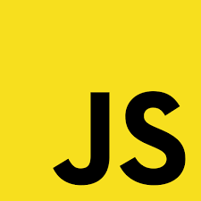

## While we wait to get started

- Install Google Chrome or Firefox
  - https://www.google.com/chrome/
  - or https://www.mozilla.org/en-US/firefox/new/
- Sign up for Codesandbox
  - https://codesandbox.io/

---



# Bootcamp

---

## About me 🤓

- @ericmasiello
- Principal Software Engineer @ Vistaprint
- Front-End Web Development (FEWD), JavaScript 101, and Code In One Day Bootcamp instructor at General Assembly
- Co-Author of _Mastering React Native_

--

## Your turn to share 🤗

- What's your name?
- Where in the world are you?
- Do you have any programming experience? (HTML, JavaScript, CSS, Ruby, Java, etc.)
- What brought you here today?

---

## Agenda

- JavaScript (JS) background
- JS in the Browser (& the DOM)
- Variables & Data Types
- Objects
- Control Flow
- Arrays and Loops
- Functions
- Bonus: Node

---

## Setting expectations

_We're building a foundation_

---

## What is JavaScript?

- Insanely popular
- High level syntax, low(ish) barrier to entry
- One of two languages that run in the browser (the other is WebAssembly)
- Can be used "server-side" or "client-side"

Note:

- High level syntax means you don't need to program to the specific hardware, the language is more generalized and typically easier to write
- Hasn't always been only browser language, nor will it always be (probably)
- Runs on the server, in robots, databases, etc

--

### In the beginning, there was HTML


<small>Credit: A Look Back at 20+ Years of Website Design - Myia Kelly</small>

Note:

- Internet predates web pages (developed by military and universities for information sharing)
- WWW and HTML invented at CERN in the late 80s, early 90s in large part by Tim Berners-Lee
- No styles, no interactivity - just text and links

--

### Make it pretty(ish)


<small>Credit: A Look Back at 20+ Years of Website Design - Myia Kelly</small>

--

### Make it interactive!


Note:

- JavaScript was developed in 10 days by one developer (Brendan Eich) for Netscape. It needed to be done quickly so that it could gain adoption over Microsoft's browser language.
- Has evolved enormously since 1995 when it was created

--

### Java vs. JavaScript

Very, very, very different.

(But a little similar)

Note:

- Two completely different languages
- At around the time time JavaScript was created, Java was newish and had a lot of buzz
- The language was originally named as LiveScript
- Netscape renamed it to JavaScript to capitalize on the cachet of Java at the time
- If you ever do a job interview, don't confuse these two languages

--

### JavaScript vs. Javascript

- Officially, its "JavaScript"
- In reality, no one cares

<style type="text/css">
#javascript-vs-javascript {
    text-transform: none;
}
</style>

---

## 🚨🚨🚨 Skiping the Basics 🚨🚨🚨

(Don't worry, we'll back to it)

---

## What's the DOM?

--

## Browser rendering in action

[](img/browser-rendering-dom-diagram.png)

--

## More details on how browser rendering works

https://itnext.io/how-the-browser-renders-a-web-page-dom-cssom-and-rendering-df10531c9969

--

## DOM: Document Object Model

- Tree data structure managed by the web browser
- Exposes an "API" to JavaScript allowing web developers to:
- Manipulate what is rendered to the screen
- Respond to interactions (e.g. specify what happens when a user clicks)

Note:

- DOM is techncially not part of the JavaScript language. Its part of the browser

--

## DOM: Document Object Model

> Essentially, the DOM is an internal data structure managed by web browsers that represents what is in the web page. It takes **HTML**, **CSS**, and instructions written in **JavaScript** to decide what it should display at any moment.

---

## `document` object

- Browser exposes the DOM to JavaScript via the `document` object
- Most client-side JavaScript involves manipulating the DOM via the `document` object

```js
// Create a <p> node
let pNode = document.createElement("p");

// Create a text node
let textNode = document.createTextNode("Hello world");

// Append the text to <p>
pNode.appendChild(textNode);

// Append <p>Hello world</p> to <body>
document.querySelector("body").appendChild(pNode);
```

--

## Getting data from the DOM

| Method Name           | Description                                   |
| --------------------- | --------------------------------------------- |
| `.getElementById()`   | Gets a single element by an ID selector       |
| `.querySelector()`    | Gets a single element matching the selector   |
| `.querySelectorAll()` | Gets a list of elements matching the selector |

\* There are additional methods for getting DOM nodes

--

## `getElementById`

```html
<html>
  <body>
    <h1 id="title">The title</h1>
    <p class="message">foo</p>
    <p>bar</p>
    <p class="message">baz</p>
  </body>
</html>
```

```js
// returns a single Node
let titleElement = document.getElementById("title");
```

--

## `querySelector`

```html
<html>
  <body>
    <h1 id="title">The title</h1>
    <p class="message">foo</p>
    <p>bar</p>
    <p class="message">baz</p>
  </body>
</html>
```

```js
// returns a single Node
let titleElement = document.querySelector("#title");

// returns a single Node, but which one?
let messageElement = document.querySelector(".message");
```

--

## `querySelectorAll`

```html
<html>
  <body>
    <h1 id="title">The title</h1>
    <p class="message">foo</p>
    <p>bar</p>
    <p class="message">baz</p>
  </body>
</html>
```

```js
// returns a NodeList of 2 elements
let messageElements = document.querySelectorAll(".message");

// returns a NodeList of 3 elements
let allParagraphElements = document.querySelectorAll("p");
```

--

## JavaScript in the wild

- [Form Validation](https://formvalidation.io/guide/plugins/bootstrap/)
- [Dynamic Navigation](https://generalassemb.ly/education/digital-marketing)

---

### How do we add JavaScript to a webpage?

`<script>👋👋👋</script>`

--

```html
<!DOCTYPE html>
<html>
  <head>
    <link rel="stylesheet" type="text/css" href="css/styles.css" />
  </head>
  <body>
    <!-- your webpage contents -->
    ...

    <script src="script.js"></script>
  </body>
</html>
```

Put it right before the closing `</body>` element

--

```html
<!DOCTYPE html>
<html>
  <head>
    <link rel="stylesheet" type="text/css" href="css/styles.css" />
    <script defer src="script.js"></script>
  </head>
  <body>
    <!-- your webpage contents -->
    ...
  </body>
</html>
```

Or use the `defer` attribute and put the `script` element anywhere

---

## Break ☕️

---

## Syntax

"...set of rules that defines the combinations of symbols that are considered to be a correctly structured \[code\] in that language."

\- [Wikipedia](https://en.wikipedia.org/wiki/Syntax_(programming_languages)

Note:
Like with any language, there are formal rules around how to write it. This is the syntax.

--

### JavaScript syntax examples

- Semicolon: marks the end of a statment 👉 `;`
- Quotation Marks: a string (of characters) 👉 `""`
- Parentheses: used to define or execute a function 👉 `fn()`

```js
function illuminateRed() {
  // do stuff
}

function setupEvents() {
  document.getElementById("stopButton").onclick = illuminateRed;
}

setupEvents();
```

--

### JavaScript syntax - comments

```js
// Single Line Comments
```

```js
/*
Multi
line
comments
*/
```

--

### Basic JavaScript Syntax

[https://www.w3schools.com/js/js_syntax.asp](https://www.w3schools.com/js/js_syntax.asp)

---

## Responding to &ldquo;events&rdquo;

`event + event handler => run some code`

Note:

- Let's cover some basic definitions

--

### Event

Typically a user interaction

e.g. click, scroll, mouseover (hover), etc.

```html
<!-- I want to know when someone clicks on this button -->
<button id="addTodo">Create new todo</button>
```

--

### Event listener/handler

A `function` whose job is to respond to some user input.

```js
// I want to know whenever someone *clicks* on the element
// with an id of "addTodo"
```

--

### Function

A self-contained set of instructions that can be reusable

```js
function handleAddTodo() {
  // code that adds a new todo to your todo list
}
```

Functions can be easily rerun (e.g. on _every_ click, run these instructions)

--

### Example

HTML

```html
<!-- I want to know when someone clicks on this button -->
<button id="addTodo">Create new todo</button>
```

JS

```js
function handleAddTodo() {
  // code that adds a new todo to your todo list
}

// Whenever someone clicks the html tag with an id="addTodo",
// run the handleAddTodo function
document.querySelector("#addTodo").onclick = handleAddTodo;
```

---

## How we solve problems in the browser with JavaScript

1.  Find some elements on the page
2.  Listen for some user interaction (click, scroll, mouseover)
3.  Respond to that event
    - Add, remove, or modify HTML
    - Add, remove, or modify CSS
    - Or anything else 🤓

--


--


--


--


--


--


---


## Traffic light

Fork this [Codesandbox](https://codesandbox.io/s/stop-light-6yw3q)

--

## Traffic light Assignment

_15 mins_

1. Make the slow button turn the 2nd light yellow
2. Make the go button turn the last light green
3. **BONUS:** Make it so that I can click the lights themselves to turn them on

_Once you've completed step 2, use the thumbs up reaction on Zoom_

---

## Variables & data types

--

### Variable

Containers for storing data values.

```js
let age = 13;
```

--

### Eric's lame scoreboard analogy

- Think of a variable like scoreboard in a sporting event.
- The scoreboard in a game keeps track of the points scored over the course of the game.
- If we didn't have a scoreboard, we would have no way to know who won the game at the end.

--

### Variable declaration

- `let` or `var` keywords tells our program that we wish to make a variable
- We choose the name
- Variables must only be _declared_ once

```js
let age;
var name; // "legacy", we won't be using "var"
```

--

### Variable assignment

- Give our declared variable a value
- This can happen multiple times

```js
age = 13;
```

--

### Variable assignment and declaration

```js
// Do assignment and declaration separately
let a;
a = 22;

// Do assignment and declaration at the same time
let b = a + 2;
```

--

### Variable reassignment

```js
// give it an intial value
let a = "Eric";

// later, give it a new value
a = "Erika";
```

--

### Constants

Allow you to assign a value once

```js
let a = "Eric";
const b = "Jim";

a = "Erika"; // ✅ OKAY ✅
b = "Mike"; // 🚫 ERROR 🚫
```

--

### Use `let` or `const`?

- Prefer `const`
- Use `let` only when you need to reassign it

--

### Name variables using "camelCase"

- Start with lowercase letter
- Each new word is capitalized

```js
let numberOfStudents = 20;
```

--

### Variable naming rules (syntax)

- Names can contain letters, digits, underscores, and dollar signs
- Names must begin with a letter, `$`, or `_`
- Names are case sensitive (`y` and `Y` are different variables)
- Reserved words (e.g. `function` or `while`) cannot be used as names

---

## Data types

--

### Breaking down this line of code

```js
let numberOfStudents = 20;
```

- JavaScript reservered word: `let`
- Name: `numberOfStudents`
- Value: `20`

--

### Data types

What can those _values_ be??

--

### JavaScript data types

- Boolean
- Number
- String
- Object\*
- Null
- Undefined
- Symbol

\* includes Dates, Arrays, Regular Expressions, Functions, and more

--

### Number

```js
// We call this type of number an "integer"
let myInteger = 10;

// And this type a "float"
let myFloat = 10.13093;

let sum = myInteger + myFloat;
```

--

### Common JavaScript Math Operators

| Operator |  Description   |      Example |
| -------- | :------------: | -----------: |
| `+`      |    Addition    | `x = y + 2;` |
| `-`      |  Subtraction   | `x = y - 2;` |
| `*`      | Multiplication | `x = y * 2;` |
| `/`      |    Division    | `x = y / 2;` |
| `%`      |   Remainder    | `x = y % 2;` |

[JavaScript Arithmetic Operators](https://developer.mozilla.org/en-US/docs/Web/JavaScript/Reference/Operators/Arithmetic_Operators)

--

### String

Text or any collection of characters

```js
const firstName = "Eric";

const lastName = "Masiello";

const fullName = firstName + " " + lastName;
// fullName = "Eric Masiello"
```

Note:

This operation is called concatenation

--

### Ways to define strings

```js
const firstName = "Eric"; // double quotes
const lastName = 'Masiello'; // single quotes
const middleName = `Jon`; // backticks
```

--

### Backticks

Allows you to "interpolate" a string (aka fancy concatenation)

```js
const name = "Eric";
const count = 3;

const message = `Hi, ${name}. You have ${count} assignments`;
// message = "Hi, Eric. You have 3 assignments";
```

--

### Boolean

True or False

```js
let todoComplete = false;

function completeTodo() {
  todoComplete = true;
}

// (1) Initialy, todoComplete is false
// (2) Next, we call the completeTodo function
completeTodo();
// (3) Now, todoComplete is true
```

---


## Calculator

Fork this [Codesandbox](https://codesandbox.io/s/calculator-p6jwe)

--

## Calculator Assignment

_15 mins_

- Use the variable declared at the top called `result` to track the value of the calculator
- Add click event handlers to each button that adds/subtracts the appropriate value
- Clicking the `0` button should reset the calculator to `0`
- After clicking any button, update the `#result` div with the current value

```js
document.getElementById("result").innerHTML = result;
```

---

## Break 🍕

---


## Objects

--

### Objects vs. simple data types

Containers that hold multiple related properties of any data type

```js
// 3 variables
const instructorName = "Eric";
const instructorcourse = "JavaScript";
const instructorYearsTeaching = 6;

// *OR* 1 object variable that contains related values
const instructor = {
  name: "Eric",
  course: "JavaScript",
  yearsTeaching: 6,
};
```

--

### Accessing properties of an object

Use the "dot" notation to access (read) properties of an object

```js
const instructor = {
  name: "Eric",
  course: "JavaScript",
  yearsTeaching: 6,
};

const greeting = "Hello, " + insturctor.name;
// greeting = "Hello, Eric"
```

--

### Modifying properties of an object

Also use dot notation to update (write) a property of an object

```js
const instructor = {
  name: "Eric",
  course: "JavaScript",
  yearsTeaching: 6,
};

let likes = "He teaches " + instructor.course;
// likes = "He teaches JavaScript"

instructor.course = "CSS";

likes = "He teaches " + instructor.course;
// likes = "He teaches CSS"
```

---

### Quick aside

One commonly used technique for debugging is `console.log()`

```js
let name = "Eric";
let obj = { a: "A", b: "B" };

console.log(name); // prints "Eric"
console.log(obj); // prints "{ a: "A", b: "B" }"
```

---

## Control Flow

if _this is true_, then do _that_. Otherwise, do _this other thing_.

--

### Handling Control Flow

- Code needs to take branching paths based on different conditions
- Typically handled with `if` / `else` statements

```js
const day = "Tuesday";
let classToday = false;

if (day === "Monday") {
  classToday = true;
}

// what is the value of classToday?
```

--

### Syntax

- Use the `if` keyword followed by parentheses
- Inside the parentheses, check the condition is "truthy"

```js

const userIsAdministrator = true;

if (userIsAdministrator === true) {
  console.log("You have admin rights!");
}

const totalSandiches = 5;

if (totalSandwiches >= 4) {
  console.log("You have a lot of sandwiches!");
}

```

--

### Common Conditional Operators

| Operator |  Description   |      Example |
| -------- | :------------: | -----------: |
| `===`      |    Equal    | `(a === false)` |
| `!==`      |  Not Equal   | `(a !== true)` |
| `>`      | Greater than | `(x > 10)` |
| `>=`      |    Greater than or equal    | `(x >= 5))` |
| `<`      |   Lesser than    | `(y < 3)` |
| `<=`      |   Lesser than or equal    | `(y <= 2)` |

--

### `if`, `else if`, and `else`

Optionally use `else if` and `else` to handle other branches of code

```js
let classToday;
const day = "Tuesday";

if (day === "Sunday") {
  classToday = false;
} else if (day === "Saturday") {
  classToday = false;
} else {
  classToday = true;
}

// what is the value of classToday?
```

---


## Employee Object

Fork this [Codesandbox](https://codesandbox.io/s/employee-object-by9ez?file=/README.md)

> You and your partner Eric are building a contact form for new employees.
> Eric wrote some code but decided to leave the rest to you.
> Thankfully, he left some instructions...

--

- Declare an object named `employee` that will store all the data we collect
- The `emplopyee` object will have 3 properties, `name`, `address`, and `favoriteColor`
- Clicking the submit button should call the function `handleSubmit`
- `handleSubmit` must update `employee` properies with the values from the `<input />` fields
- `handleSubmit` must call `renderEmployeeDetails()` as the last thing it does
- **BONUS**: Eric dislikes the color `"orange"`. If the user types `"orange"` as their favorite color, reassign it to `"green"` and console log the message `"I dont like orange."`

---

## Arrays and Loops

--

### What is an Array?

- Special type of `Object` used to store a collection of data
- Ofter referred to as a "list" or "collection"
- Values are comma separted
- Use square brackets to create an array `[]`

--

### Assigning an array

```js
const names = ["Bryan", "Kyril", "Mike", "PJ"];
const favoriteNumbers = [8, 3, 22, 12];

console.log(names); // ["Bryan", "Kyril", "Mike", "PJ"]
console.log(favoriteNumbers); // [8, 3, 22, 12]
```

--

### Accessing individual values in an array

- Arrays are `0` (zero) indexed
- The first element in the array can be accessed via `variableName[0]`.

```js
const names = ["Bryan", "Kyril", "Mike", "PJ"];

console.log(names[0]); // "Bryan"
console.log(names[3]); // "PJ"
console.log(names.length); // 4
```

--

### Adding values to an array

Add elements to the _end_ of an array using `.push()`

```js
const names = ["Bryan", "Kyril", "Mike", "PJ"];
console.log(names.length); // 4

names.push("Eric");

console.log(names[4]); // "Eric"
console.log(names.length); // 5
```

--

### Adding values to an array

Add elements to the _beginning_ of an array using `.unshift()`

```js
const names = ["Bryan", "Kyril", "Mike", "PJ"];
console.log(names.length); // 4
console.log(names[0]); // "Bryan"

names.unshift("Eric");

console.log(names[0]); // "Eric"
console.log(names.length); // 5
```

--

### Removing values from an array

Remove elements at the _end_ of an array using `.pop()`

```js
const names = ["Bryan", "Kyril", "Mike", "PJ"];
console.log(names.length); // 4

names.pop();

console.log(names.length); // 3
console.log(names); // ["Bryan", "Kyril", "Mike"];
```

--

### Removing values from an array

Remove elements at the _beginning_ of an array using `.shift()`

```js
const names = ["Bryan", "Kyril", "Mike", "PJ"];
console.log(names.length); // 4

names.shift();

console.log(names.length); // 3
console.log(names); // ["Kyril", "Mike", "PJ"];
console.log(names[0]); // "Kyril"
```

--

### Arrays can hold any value type

```js
const employees = [
  { name: "Eric Masiello", yearsInJob: 4 },
  { name: "Jennifer Yan", yearsInJob: 12 },
];

const numberPairs = [
  [1, 2],
  [3, 4],
  [5, 6],
];
```

---

## Break ☕️

---


## Things I Learned Today

Fork this [Codesandbox](https://codesandbox.io/s/items-learned-arrays-qslny?file=/README.md)

---

## 🔄 Loops 🔄

--

## Why loops?

- Loops allow you to perform a series of operations while certain conditions are true
- Often used to do some action for each item in an array
- There are multiple ways to express loops in JavaScript

--

### Average score using a `for-of` loop

For each value in an array, a `for-of` loop creates a temporary variable
to store the current value of the array.

```js
const studentScores = [90, 85, 76, 92, 65];
let scoreSum = 0;

for (const score of studentScores) {
  scoreSum = scoreSum + score;
}
// scoreSum = 408

const average = scoreSum / studentScores.length;
// average = 81.6
```

--

### Average score using a `for` loop

A traditional `for` loop uses the _index_ to access values
e.g. `studentScores[0]`

```js
const studentScores = [90, 85, 76, 92, 65];
let scoreSum = 0;

// Note: must use `let`, not `const`
for (let i = 0; i < studentScores.length; i++) {
  scoreSum = scoreSum + studentScores[i];
}
// scoreSum = 408

const average = scoreSum / studentScores.length;
// average = 81.6
```

[Why you cannot use `const` in a `for` loop](https://medium.com/@mautayro/es6-variable-declaration-for-loops-why-const-works-in-a-for-in-loop-but-not-in-a-normal-a200cc5467c2)

--

### `while` loop

While loops do not directly operate on arrays like a `for` or `for-of` loop

```js
let counter = 0;

while (counter < 10) {
  console.log(counter);
  counter = counter + 1;
}

// What does this program console log out?
```

--

### ⚠️⚠️ Beware of infinite loops! ⚠️⚠️

```js
let counter = 0;

while (counter < 10) {
  console.log(counter);
}

// What's wrong with this?
```

---

## Functions

--

### Declaring a function

Delcare with the `function` keyword, `()`, and a pair of `{}`;

```js
function setClassNameAsBar() {
  document.querySelector("#foo").className = "bar";
}
```

--

### Calling a function

Call a function by using the function's name followed by `()`

```js
function setClassNameAsBar() {
  document.querySelector("#foo").className = "bar";
}

// this tells the program to run the body of the function
setClassNameAsBar();
```

--

### Understanding execution order

```js
console.log("a");

function logB() {
  console.log("b");
}

console.log("c");
logB();
logD();

function logD() {
  console.log("d");
}

logB();
console.log("e");
```

What would be console logged to the screen?

--

### Parameters &amp; Arguments

- Functions allow you to _pass_ values to them that are scoped to their function body
- _Parameters_ are the variable names that appear within the function's `()`
- _Arguments_ are the _actual_ values passed to the function

```js
function setCustomClassName(newClassName) {
  // `newClassName` is a parameter of `setCustomClassName`
  document.querySelector("#foo").className = newClassName;
}

setCustomClassName("error"); // "error" is the argument
setCustomClassName("warning"); // "warning" is the argument
setCustomClassName(""); // "" (empty string) is the argument
```

--

### A rough mental model of arguments and parameters

```js
function setCustomClassName(newClassName) {
  // once this function is called with "error", internally its as if
  // the program has inserted the following line of code:

  // var newClassName = "error";
  document.querySelector("#foo").className = newClassName;
}

setCustomClassName("error");
```

--

### Multiple parameters/arguments

```js
function add(a, b, c) {
  // a = 2, b = 5, c = 3
  const sum = a + b + c;
}

add(2, 5, 3);
```

--

### Returning a value from a function

- Functions can pass a value back to the caller using the `return` keyword
- **Note:** as soon as a function executes a `return` statement, it stops running any additional code in the function

```js
function add(a, b, c) {
  const sum = a + b + c;

  // returns the value OUT of the function back
  // to where it was called. i.e. add(2, 5, 3)
  return sum;
}

const result = add(2, 5, 3);
// result = 10
```

--

### Quick Quiz

Follow the exeuction order

```js
function doMath(a, b) {
  const sum = a + b;
  return double(sum);
}

function double(n) {
  return n * 2;
}

const result = doMath(2, 4);

// what is result?
```

--

### Arrow functions

- Arrow functions are another way of expressing functions
- Similar to `var` vs. `let`, they have some subtle differences from "regular" function declarations

```js

// function setCustomClassName(newClassName) {
//   document.querySelector("#foo").className = newClassName;
// }

const setCustomClassName = () => {
  document.querySelector("#foo").className = "bar";
};

setCustomClassName();
```

--

### Fancy arrow functions

If the body of your function is a one line expression, you can omit the `return` and `{}`

```js
const doubleA = (n) => {
  return n * 2;
};


const doubleB = (n) => n * 2; // no `return` or `{}` needed
```

---

## BONUS: Node.js


--

### Node.js

- Developed in 2009
- Built on top of Google Chrome's _V8_ JavaScript engine
- Open source runtime environment for running server-side JavaScript applications
- Install the _LTS_ version from https://nodejs.org/

--

### Sample Node app

- Copy this code http://bit.ly/2tpAOXZ
- Save as add.js
- Open your command line tool

```
node add.js 3 4
```

---

## Resources

- _Books_
- [You Don't Know JS: Up & Going](http://shop.oreilly.com/product/0636920039303.do)
- _Online_
- [Code Academy (Free)](https://www.codecademy.com/)
- [Beginner JavaScript](https://beginnerjavascript.com/)
- [JavaScript 30 (Free)](https://javascript30.com/)
- _In Person Courses_
- [Web Development Immersive (Full Time)](https://generalassemb.ly/education/web-development-immersive)
- [Front End Development (Part time)](https://generalassemb.ly/education/front-end-web-development)
- [JavaScript (Part Time)](https://generalassemb.ly/education/javascript-development)

---

## Thank you! 🙏🏼🙏🏼🙏🏼
